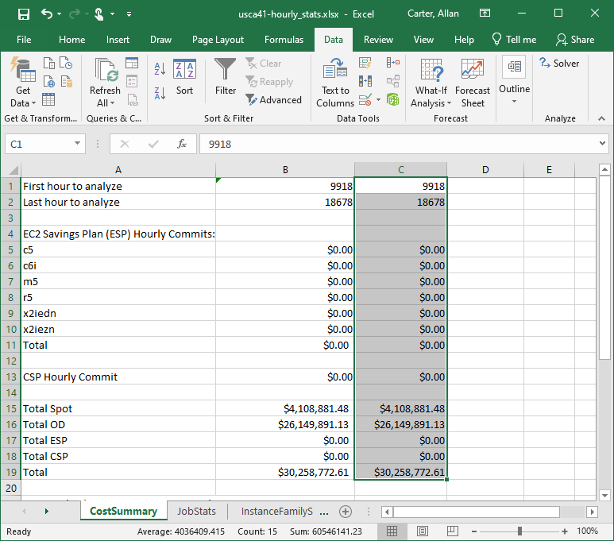

# Output

By default, HCS places all output files in the `output/` folder (this can be changed usign the `--output-dir` parameter to `JobAnalyzer.py`). 

## Output files:

|File Name                          |Qantity   |Description                                                                                                                     |
|-----------------------------------|----------|--------------------------------------------------------------------------------------------------------------------------------|
|hourly_stats.xlsx                  |1         |The full anonymized output, the only file you'll share with your AWS account team should you want guidance on cost optimization |
|hourly-######.csv                  |1 per hour|Temporary file, includes all the jobs that started in a secific hour                                                            |
|summary.csv                        |1         |Aggregated summary of all your jobs (statistics). This data also appears in the Excel output file                               |
|hourly_stats.csv                   |1         |Host simulation output, includes. This data also appears in the Excel output file.                                              |
|JobAnalyzer-####-##-##_##-##-##.log|1         |Simulation log file for trouble shooting                                                                                        |

### summary.csv

Provides aggregated data on the jobs (at the individual task level) including the number of jobs, the total runtime, and the total wait time. These provide a high-level understanding of the customer's workload and helps us show the customer how much of their workload needs high memory instances (usually only a small percentage) and therefore the opportunity for savings from right-sizing their compute instaces.

The wait time only includes the time the job waited after it was eligible to run.
For example, if the job was waiting on a license or a dependency on another job, then the time that the jobs was ineligble to run is
not included in the wait time.
The reported wait time is the time that the job waited for compute resources to become available.

Example:

|MemorySize      |0-1 Minutes     |<--             |<--             |1-5 Minutes     |<--             |<--             |5-20 Minutes    |<--             |<--             |20-60 Minutes   |<--             |<--             |60-240 Minutes  |<--             |<--             |240-1440 Minutes|<--             |<--             |1440-1000000 Min|<--             |<--             |
|----------------|----------------|----------------|----------------|----------------|----------------|----------------|----------------|----------------|----------------|----------------|----------------|----------------|----------------|----------------|----------------|----------------|----------------|----------------|----------------|----------------|----------------|
|                |Job count       |Total duration  |Total wait time |Job count       |Total duration  |Total wait time |Job count       |Total duration  |Total wait time |Job count       |Total duration  |Total wait time |Job count       |Total duration  |Total wait time |Job count       |Total duration  |<--             |Job count       |Total duration  |Total wait time |
|0-1GB           |1451224         |295357          |0               |298597          |711710          |0               |268244          |2464401         |0               |84075           |2832260         |0               |48673           |5699891         |0               |21450           |14928398        |<--             |37222           |940366200       |0               |
|1-2GB           |7800            |4645            |0               |33076           |88381           |0               |27230           |285958          |0               |11301           |390683          |0               |9244            |1129832         |0               |5195            |3431642         |<--             |4444            |104405917       |0               |
|2-4GB           |3866            |2482            |0               |68157           |201630          |0               |94798           |1120678         |0               |108126          |3764462         |0               |47593           |5155126         |0               |17470           |10450704        |<--             |7154            |100846783       |0               |
|4-8GB           |425             |219             |0               |5352            |17497           |0               |9978            |106535          |0               |7959            |275142          |0               |5768            |701616          |0               |3831            |2662791         |<--             |3218            |66155544        |0               |
|8-16GB          |759             |274             |0               |722             |2044            |0               |5904            |72149           |0               |4462            |183369          |0               |11244           |1307581         |0               |6363            |3983032         |<--             |3024            |42831455        |0               |
|16-32GB         |389             |108             |0               |237             |771             |0               |1148            |14321           |0               |1573            |58971           |0               |2971            |359024          |0               |2577            |1766540         |<--             |2017            |29588185        |0               |
|32-64GB         |435             |133             |0               |63              |209             |0               |605             |7613            |0               |1079            |41389           |0               |1731            |206706          |0               |1283            |1026257         |<--             |1107            |22509888        |0               |
|64-128GB        |160             |60              |0               |71              |140             |0               |35              |383             |0               |110             |4379            |0               |244             |33840           |0               |408             |284120          |<--             |285             |6939359         |0               |
|128-256GB       |177             |81              |0               |125             |275             |0               |107             |743             |0               |45              |1826            |0               |122             |15285           |0               |258             |206859          |<--             |192             |5132956         |0               |
|256-512GB       |580             |227             |0               |297             |889             |0               |330             |3258            |0               |249             |9267            |0               |165             |20148           |0               |53              |35973           |<--             |69              |1955220         |0               |
|512-1000000GB   |498             |249             |0               |447             |918             |0               |226             |2116            |0               |141             |4907            |0               |45              |5168            |0               |41              |29869           |<--             |26              |729017          |0               |

In this (real customer) example, over 95% of the jobs were not memory intensive (below 32GB/Core), but the customer is sizing their entire HPC fleet for the more memory intensive 5% of the workload.

### hourly_stats.csv

Provides an hour-by-hour cost simulation broken down by spot and on-demand costs.

|Relative Hour       |Total OnDemand Costs|Total Spot Cost     |m5                  |r5                  |
|--------------------|--------------------|--------------------|--------------------|--------------------|
|0                   |8.93                |0.00                |8.93                |0.00                |
|1                   |10.97               |0.00                |10.97               |0.00                |
|2                   |11.02               |0.00                |11.02               |0.00                |
|3                   |10.88               |0.00                |10.88               |0.00                |
|4                   |11.02               |0.00                |11.02               |0.00                |
|5                   |10.96               |0.00                |10.96               |0.00                |
|6                   |11.00               |0.00                |11.00               |0.00                |
|7                   |11.02               |0.00                |11.02               |0.00                |
|8                   |11.03               |0.00                |11.03               |0.00                |
|9                   |11.22               |0.00                |11.16               |0.05                |
|10                  |12.93               |0.00                |11.26               |1.66                |
|11                  |12.98               |0.00                |11.54               |1.44                |
|12                  |13.04               |0.00                |11.21               |1.82                |
|13                  |10.25               |0.00                |10.21               |0.03                |
|14                  |11.92               |0.00                |11.07               |0.84                |
|15                  |15.58               |0.00                |11.53               |4.05                |
|16                  |13.97               |0.00                |12.09               |1.87                |
|17                  |17.04               |0.00                |12.82               |4.21                |
|18                  |25.28               |0.00                |12.23               |13.05               |

### hourly_stats.xlsx

The Excel spreadsheet provides a convenient way to view the data and perform calculations on it.
For example, in the following example the "**First hout to analyze**" was changed to only include the last 12 months worth of data.

The **InstanceFamilySummary** worksheet can be used to get insights into the predicted usage of different instance families.
In this example it shows that the c6i family is used the most with very little utilization of other instance families.
The average hourly use can be used to help choose the upper constraint for the savings plans.

#### Optimize Savings Plans Using Excel Solver

Excel includes a numerical solver that can be used to optimize the use of Savings Plans to reduce your compute costs.
The instructions for setting up the solver are on the "**CostSummary**" tab of the spreadsheet.

First, enable the Excel solver.
Select **File** -> **Options**

Select **Add-ins** on the lower left.

If the **Solver Add-in** isn't active then select **Manage: Excel Add-ins** and click **Go**.

Select the **Solver Add-in** and click **OK**.

If the **Solver Add-in** is already active then it will show up like this.

Now you are ready to run the solver.
Copy the original values by selecting column B and pasting the values into column C.
Then select the **Data** menu select **Solver** on the ribbon.
 the **Solver Add-in** is already active then it will show up like this.

Configure the solver by selecting the total cost as the **Objective**.
Then select the Savings Plan commit cells in **By Changing Variable Cells:**.
Then add constraints for the Savings Plan commit cells.
Then click **Solve** and wait while the Solver calculates the savings plan commits
that will minimie your overall costs.

The solver may run a while, but when it finishes then save the results.

The spreadsheet will then show the savings plan commits that minimize the total costs.
In this case Savings Plans were able to reduce total costs by about 10%.
Note that this is due to the very variable nature of the jobs.
The more sustained usage that you have, the more cost-effective Savings Plans will be.

This graph shows the variability of the workload.

