# Output

HCS generates multiple output files:

|File Name                          |Qantity   |Description                                                                                                                     |
|-----------------------------------|----------|--------------------------------------------------------------------------------------------------------------------------------|
|hourly_stats.xlsx                  |1         |The full anonymized output, the only file you'll share with your AWS account team (should you choose to do so                   |
|hourly-######.csv                  |1 per hour|Temporary files, includes all the jobs that started in a secific hour                                                           |
|summary.csv                        |1         |Aggregated summary of all your jobs (statistics). This data also appears in the Excel output file                               |
|hourly_stats.csv                   |1         |Host simulation output, includes. This data also appears in the Excel output file.                                              |
|JobAnalyzer-####-##-##_##-##-##.log|1         |Simulation log file for trouble shooting                                                                                        |

### hourly_stats.xlsx

This is the main output file, and will be analyzed moving forward. All other files are only used for troubleshooting and or re-running a subset of the analysis.

The Excel spreadsheet provides a convenient way to view the data and perform calculations on it.
For example, in the following example the "**First hour to analyze**" was changed to only include the last 12 months worth of data.

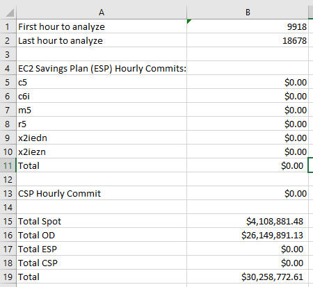

The **InstanceFamilySummary** worksheet can be used to get insights into the predicted usage of different instance families.
In this example it shows that the c6i family is used the most with very little utilization of other instance families.
The average hourly use can be used to help choose the upper constraint for the savings plans.

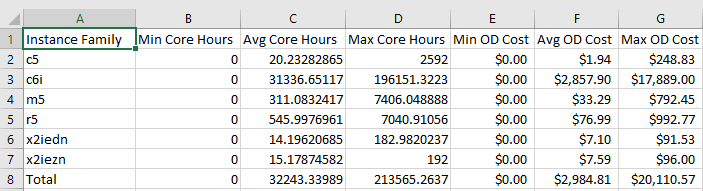

### Savings Plan Optimization

`houly_stats.xlsx` allows you to optimize your costs further by simulating the impact of [Savings Plans](https://aws.amazon.com/savingsplans/) (SP) on your overall costs, and finding the optimal SP cost for your workload. To do this, you will need to enable Excel's numerical solver add-in.

To use the solver, you first need to enable it.

#### Windows:

Select **File** -> **Options**

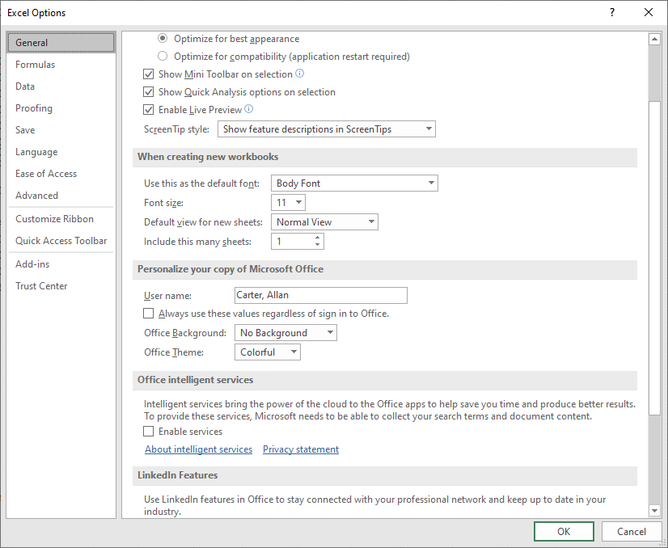

Select **Add-ins** on the lower left.

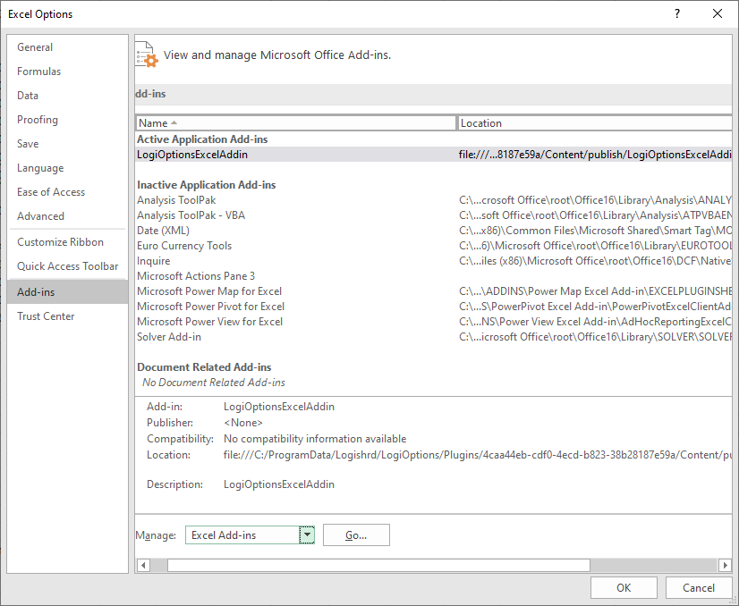

If the **Solver Add-in** isn't active then select **Manage: Excel Add-ins** and click **Go**.

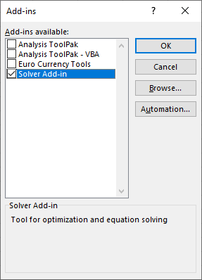

Select the **Solver Add-in** and click **OK**.

If the **Solver Add-in** is already active then it will show up like this.

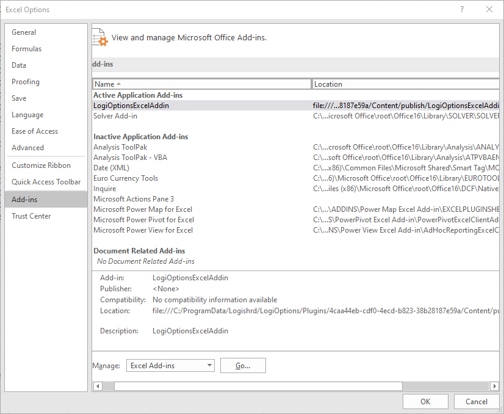

#### Mac OS:

Select **Tools** -> **Options**

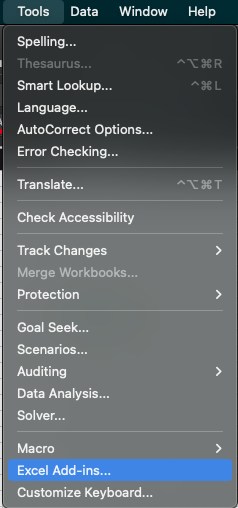

If the **Solver Add-in** isn't active then select it and click **OK**.

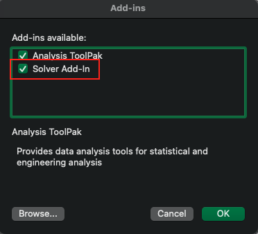

#### Optimize Savings Plans Using Excel Solver

Now you are ready to run the solver.
Copy the original values by selecting column B and pasting the values into column C (This will allow you to compare before vs. after cost optimization).

Then select the **Data** menu select **Solver** on the ribbon.

Configure the solver by selecting the total cost as the **Objective**.
Then select the Savings Plan commit cells in **By Changing Variable Cells**.

Do **not** select the total cell, only the $ value for specific instance family types:

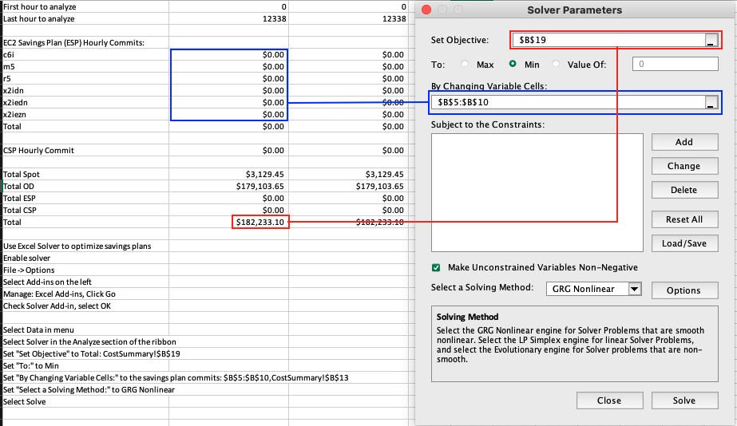

Optionally, you may add constraints for the Savings Plan commit cells.

**Windows:**

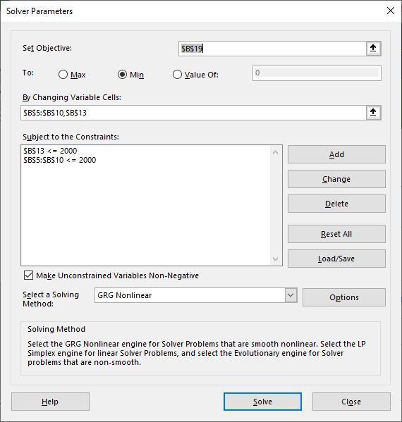

**Mac OS**

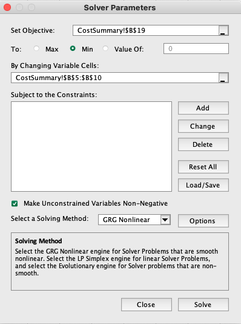

Then click **Solve** and wait while the Solver calculates the savings plan commits
that will minimie your overall costs.
The solver may run a while, but when it finishes then save the results.

**Windows:**

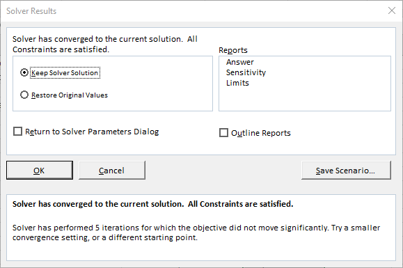

**Mac OS:**

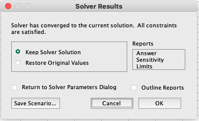

The spreadsheet will then show the savings plan commits that minimize the total costs.
In this case Savings Plans were able to reduce total costs by about 10%.
Note that this is due to the very variable nature of the jobs.
The more uniform usage you have, the more cost-effective Savings Plans will be.

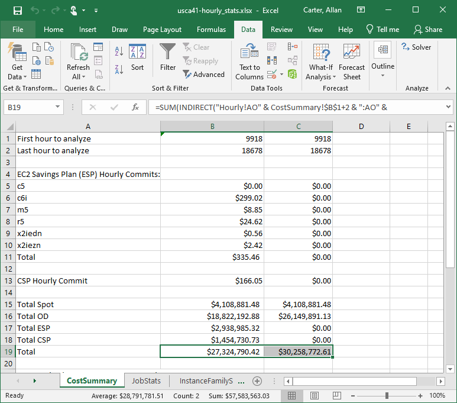

This graph shows the variability of the workload.

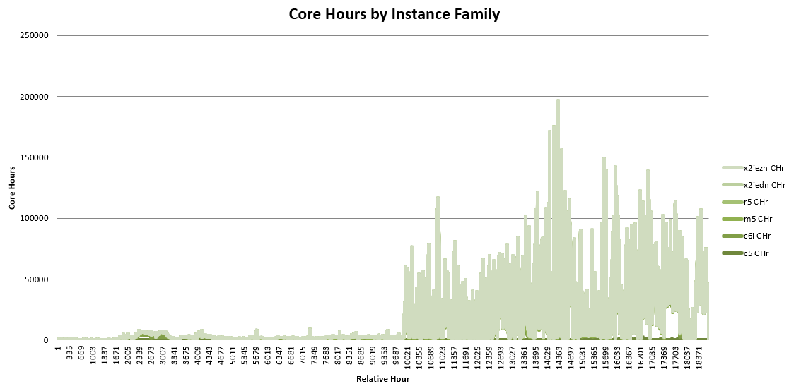
